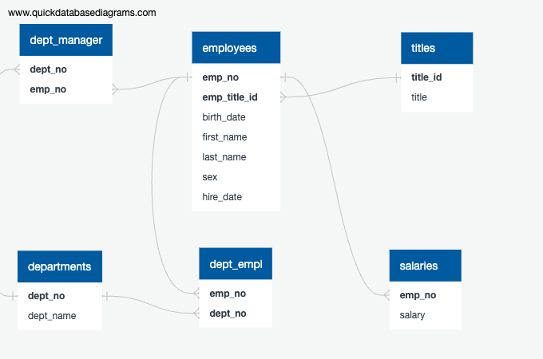

# SQL Challenge: Employee Database Analysis

## Overview
In this Project, I analize employee data from Pewlett Hackard (a fictional company) from the 1980s and 1990s. The analysis is based on six CSV files containing various employee information. The project includes data modeling, data engineering, and data analysis.

## Assignment Structure 
The repository is organized as follows:
```
sql-challenge/
│
├── EmployeeSQL/
    ├── Data/                  # Folder containing the CSV files
    │   ├── departments.csv
    │   ├── dept_emp.csv
    │   ├── dept_manager.csv
    │   ├── employees.csv
    │   ├── salaries.csv
    │   └── titles.csv
    │
    ├── ERD.png         # Entity Relationship Diagram
    │     
    │
    ├── schema.sql       # SQL file with table creation schema
    ├── queries.sql            # SQL file with analysis queries
    └── README.md              # Project documentation


```

## Data Modeling
An Entity Relationship Diagram (ERD) was created to visualize the relationships between the six tables:
- departments
- dept_emp
- dept_manager
- employees
- salaries
- titles



## Data Engineering
Tables were created to store the data from the CSV files. The tables include appropriate data types, primary keys, foreign keys, and constraints. 

Key considerations in the schema design:
- Primary keys were established for each table
- Foreign keys were used to create relationships between tables
- NOT NULL constraints were applied where necessary
- Appropriate data types and lengths were defined

## Data Analysis
The following analyses were performed on the employee database:

1. Employee details including number, name, sex, and salary
2. Employees hired in 1986
3. Department managers with their department information
4. Department information for each employee
5. Employees with the first name "Hercules" and last name starting with "B"
6. Employees in the Sales department
7. Employees in the Sales and Development departments
8. Frequency counts of employee last names

## Technologies Used
- PostgreSQL
- QuickDBD (for ERD creation)
- SQL

## Installation and Setup
1. Clone this repository to your local machine
2. Create a database in PostgreSQL
3. Run the `table_schema.sql` file to create the tables
4. Import the CSV files into their respective tables
5. Run the `queries.sql` file to perform the analyses

## Results
The analysis revealed interesting patterns in the employee data, such as:
- 8 tables based on 8 querries 

## Acknowledgements
Amazing Tutor 

## License
GNU GENERAL PUBLIC LICENSE
